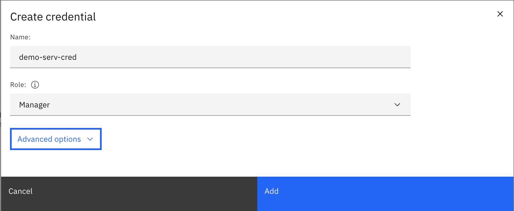
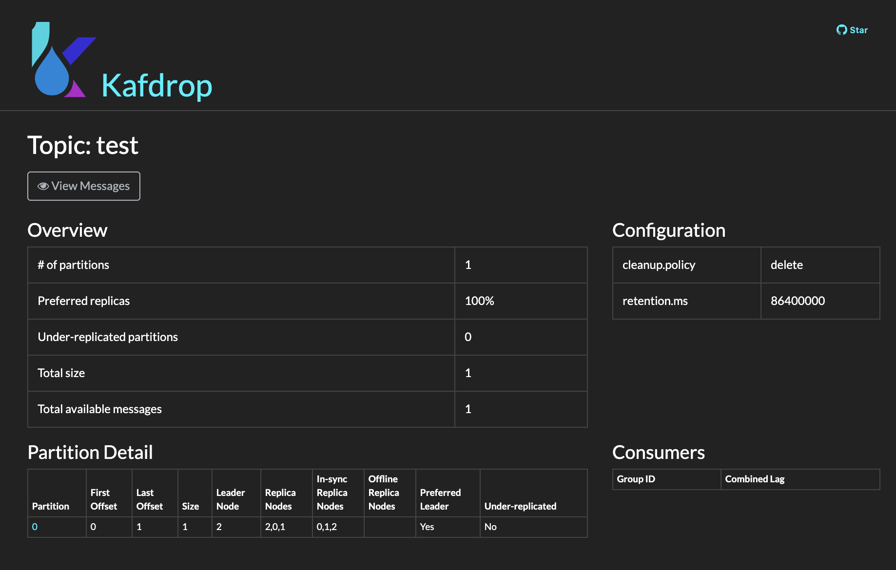

# IBM Event Streams on IBM Cloud Schema Registry lab

This documentation aims to be a introductory hands-on lab on IBM Event Streams on IBM Cloud Schema Registry where we will go through the different capabilities of the Schema Registry that is available for IBM Event Streams on IBM Cloud users.


## Index

* [Requirements](#requirements)
* [Explore](#explore)
* [Topics](#topics)
* [API Key](#api-key)
* [Kafdrop](#kafdrop)
* [Python Demo Environment](#python-demo-environment)
* [Python Producer](#python-producer)
* [Python Consumer](#python-consumer)
* [Messages](#messages)
* [Schema Registry](#schema-registry)
* [Schemas](#schemas)
* [Messages and Schemas](#messages-and-schemas)
* [Data Evolution](#data-evolution)
* [Access Management](#access-management)

## Requirements

This lab requires the following components to work against:

1. An IBM Cloud account.
1. An IBM Event Streams instance with the Enterprise plan (Schema Registry is only available to these instance for now) - <https://cloud.ibm.com/docs/EventStreams?topic=eventstreams-getting_started>

On your development workstation you will need:

1. IBM Cloud CLI - <https://cloud.ibm.com/docs/cli?topic=cloud-cli-getting-started>
1. IBM CLoud CLI Event Streams plugin - <https://cloud.ibm.com/docs/EventStreams?topic=eventstreams-cli#step5_es_cli>
1. Docker - <https://docs.docker.com/get-docker/>
1. Kafdrop - <https://github.com/obsidiandynamics/kafdrop>

## Explore

In this section we are going to do a quick exploration of our out of the box IBM Event Streams instance on IBM Cloud.

### CLI

1. Go to IBM Cloud and click on the user avatar on the top right corner. Then, click on _Log in to CLI and API_ option:

   

1. Copy the `IBM Cloud CLI` login command

   

1. Open a terminal window, paste and execute the command:

	```shell
	$ ibmcloud login -a https://cloud.ibm.com -u passcode -p XsgEKGb84Z
	API endpoint: https://cloud.ibm.com
	Authenticating...
	OK

	Targeted account Kedar Kulkarni's Account (b636d1d83e34d7ae7e904591ac248cfa) <-> 1951550


	Select a region (or press enter to skip):
	1. au-syd
	2. in-che
	3. jp-osa
	4. jp-tok
	5. kr-seo
	6. eu-de
	7. eu-gb
	8. us-south
	9. us-south-test
	10. us-east
	Enter a number> 6
	Targeted region eu-de


	API endpoint:      https://cloud.ibm.com
	Region:            eu-de
	User:              ALMARAZJ@ie.ibm.com
	Account:           Kedar Kulkarni's Account (b636d1d83e34d7ae7e904591ac248cfa) <-> 1951550
	Resource group:    No resource group targeted, use 'ibmcloud target -g RESOURCE_GROUP'
	CF API endpoint:
	Org:
	Space:
	```

1. List your services with `$ ibmcloud resource service-instances` and make sure your IBM Event Streams instance is listed:

	```shell
	$ ibmcloud resource service-instances
	Retrieving instances with type service_instance in all resource groups in all locations under account Kedar Kulkarni's Account as ALMARAZJ@ie.ibm.com...
	OK
	Name                                   Location   State    Type
	IBM Cloud Monitoring with Sysdig-rgd   us-south   active   service_instance
	apieky for simple toolchain            us-east    active   service_instance
	aapoc-event-streams                    us-south   active   service_instance
	tutorial                               us-south   active   service_instance
	mooc-integration-logdna                us-south   active   service_instance
	mooc-integration-sysdig                us-south   active   service_instance
	Event Streams-2t                       us-south   active   service_instance
	Event Streams-wn                       eu-de      active   service_instance
	```

	We can see our instance called: **Event Streams-wn**

1. List your IBM Event Streams instance details with `ibmcloud resource service-instance <instance_name>`:

	```shell
	$ ibmcloud resource service-instance Event\ Streams-wn 
	Retrieving service instance Event Streams-wn in all resource groups under account Kedar Kulkarni's Account as ALMARAZJ@ie.ibm.com...
	OK

	Name:                  Event Streams-wn
	ID:                    crn:v1:bluemix:public:messagehub:eu-de:a/b636d1d83e34d7ae7e904591ac248cfa:b05be932-2a60-4315-951d-a6dd902e687a::
	GUID:                  b05be932-2a60-4315-951d-a6dd902e687a
	Location:              eu-de
	Service Name:          messagehub
	Service Plan Name:     enterprise-3nodes-2tb
	Resource Group Name:
	State:                 active
	Type:                  service_instance
	Sub Type:
	Created at:            2020-05-11T15:54:48Z
	Created by:            kedar.kul@us.ibm.com
	Updated at:            2020-05-11T16:49:18Z
	Last Operation:
						Status    sync succeeded
						Message   Synchronized the instance
	```
	Mind the `\` character in your IBM Event Streams instance.

1. Initialize your IBM Event Streams plugin for the IBM Cloud CLI with `$ ibmcloud es init`:

	```shell
	$ ibmcloud es init

	Select an Event Streams instance:
	1. Event Streams-2t
	2. Event Streams-wn
	3. aapoc-event-streams
	4. tutorial
	Enter a number> 2
	API Endpoint: 	https://mh-tcqsppdpzlrkdmkbgmgl-4c201a12d7add7c99d2b22e361c6f175-0000.eu-de.containers.appdomain.cloud
	OK
	```

1. Check all the CLI commands available to you to manage and interact with your IBM Event Streams instance with `$ ibmcloud es`:

	```shell
	$ ibmcloud es
	NAME:
	ibmcloud es - Plugin for IBM Event Streams (build 1908221834)

	USAGE:
	ibmcloud es command [arguments...] [command options]

	COMMANDS:
	broker                 Display details of a broker.
	broker-config          Display broker configuration.
	cluster                Display details of the cluster.
	group                  Display details of a consumer group.
	group-delete           Delete a consumer group.
	group-reset            Reset the offsets for a consumer group.
	groups                 List the consumer groups.
	init                   Initialize the IBM Event Streams plugin.
	topic                  Display details of a topic.
	topic-create           Create a new topic.
	topic-delete           Delete a topic.
	topic-delete-records   Delete records from a topic before a given offset.
	topic-partitions-set   Set the partitions for a topic.
	topic-update           Update the configuration for a topic.
	topics                 List the topics.
	help, h                Show help

	Enter 'ibmcloud es help [command]' for more information about a command.
	```

1. List your cluster configuration with `$ ibmcloud es cluster`:

	```shell
	$ ibmcloud es cluster
	Details for cluster
	Cluster ID                                                      Controller
	mh-tcqsppdpzlrkdmkbgmgl-4c201a12d7add7c99d2b22e361c6f175-0000   0

	Details for brokers
	ID   Host                                                                                                     Port   Rack
	0    kafka-0.mh-tcqsppdpzlrkdmkbgmgl-4c201a12d7add7c99d2b22e361c6f175-0000.eu-de.containers.appdomain.cloud   9093   fra05
	1    kafka-1.mh-tcqsppdpzlrkdmkbgmgl-4c201a12d7add7c99d2b22e361c6f175-0000.eu-de.containers.appdomain.cloud   9093   fra02
	2    kafka-2.mh-tcqsppdpzlrkdmkbgmgl-4c201a12d7add7c99d2b22e361c6f175-0000.eu-de.containers.appdomain.cloud   9093   fra04
	No cluster-wide dynamic configurations found.
	```

1. List your topics with `$ ibmcloud es topics`:

	```shell
	$ ibmcloud es topics
	OK
	No topics found.
	```

### UI

1. Go to IBM Cloud, log in and click on _Services_ on the top left _Resource summary_ panel:

	

1. Click on your IBM Event Streams instance:

	

1. Click on _Launch Dashboard_ button to open the IBM Event Streams dashboard

	

1. Click on the _Topics_ tab on the top bar menu:

	

1. Observe there isn't any topic yet:

	

## Topics

In this section we are going to see how to create, list and delete topics both using the IBM Event Streams CLI and its UI.

### CLI

1. Create a topic:

	```shell
	$ ibmcloud es topic-create --name demo-topic
	Created topic demo-topic
	OK
	```
	\* Execute `$ ibmcloud es topic-create --help` for more further configuration of your topic creation

1. List topics:

	```shell
	$ ibmcloud es topics
	Topic name
	demo-topic
	OK
	```

1. Display details of a topic:

	```shell
	$ ibmcloud es topic demo-topic
	Details for topic demo-topic
	Topic name   Internal?   Partition count   Replication factor
	demo-topic   false       1                 3

	Partition details for topic demo-topic
	Partition ID   Leader   Replicas   In-sync
	0              2        [2 1 0]    [2 1 0]

	Configuration parameters for topic demo-topic
	Name                  Value
	cleanup.policy        delete
	min.insync.replicas   2
	segment.bytes         536870912
	retention.ms          86400000
	retention.bytes       1073741824
	OK
	```

1. Delete a topic:

	```shell
	$ ibmcloud es topic-delete demo-topic
	Really delete topic 'demo-topic'? [y/N]> y
	Topic demo-topic deleted successfully
	OK
	```

1. List topics:

	```shell
	$ ibmcloud es topics
	OK
	No topics found.
	```

### UI

1. Open the IBM Event Streams user interface (go into your IBM Event Streams service within your IBM Cloud portal and click on the launch dashboard button). Once there, click on the _Topics_ tab from the top menu:

	

1. Click on _Create topic_ button, give your topic a name and click on next

	

1. Set as many partitions for your topic as you desire. For this demo, the default 1 partition suffices. Click next.

	

1. Set the message retention you consider best for your use case. For this demo, we will leave the default _A day_ option. Click on _Create topic_:

	

1. We can now see our new topic:

	

1. To delete a topic, click on the topic options button at the right end of a topic, click on _Delete this topic_ and then on the _Delete_ button in the confirmation pop-up window:

	

1. The topic should now be deleted:

	

## API Key

At this point, we want to create an API key for other applications, tools, scripts to interact with our IBM Event Streams instance.

1. In your IBM Event Streams instance service page, click on _Service credentials_ on the left hand side menu:

	

1. Observe, there is no service credentials yet and click on the _New credential_ button on the top right corner:

	

1. Enter a name for your service, choose _Manager_ role for now and click on _Add_:

	

1. You should now see your new service credential and be able to inspect its details if you click on its dropdown arrow on it left:

	

1. We could have created the service credentials using the CLI as well but we leave that as extra homework for students to try on their own. However, we can explore the service credentials using the CLI with `$ ibmcloud resource service-key <service_credentials_name>`:

	```shell
	$ ibmcloud resource service-key demo-serv-cred
	Retrieving service key demo-serv-cred in all resource groups under account Kedar Kulkarni's Account as ALMARAZJ@ie.ibm.com...

	Name:          demo-serv-cred
	ID:            crn:v1:bluemix:public:messagehub:eu-de:a/b636d1d83e34d7ae7e904591ac248cfa:b05be932-2a60-4315-951d-a6dd902e687a:resource-key:4ba348d2-5fcf-4c13-a265-360e983d99c5
	Created At:    Tue May 12 10:53:02 UTC 2020
	State:         active
	Credentials:
				api_key:                  *****
				apikey:                   *****
				iam_apikey_description:   Auto-generated for key 4ba348d2-5fcf-4c13-a265-360e983d99c5
				iam_apikey_name:          demo-serv-cred
				iam_role_crn:             crn:v1:bluemix:public:iam::::serviceRole:Manager
				iam_serviceid_crn:        crn:v1:bluemix:public:iam-identity::a/b636d1d83e34d7ae7e904591ac248cfa::serviceid:ServiceId-380e866c-5914-4e01-85c4-d80bd1b8a899
				instance_id:              b05be932-2a60-4315-951d-a6dd902e687a
				kafka_admin_url:          https://mh-tcqsppdpzlrkdmkbgmgl-4c201a12d7add7c99d2b22e361c6f175-0000.eu-de.containers.appdomain.cloud
				kafka_brokers_sasl:       [kafka-2.mh-tcqsppdpzlrkdmkbgmgl-4c201a12d7add7c99d2b22e361c6f175-0000.eu-de.containers.appdomain.cloud:9093 kafka-0.mh-tcqsppdpzlrkdmkbgmgl-4c201a12d7add7c99d2b22e361c6f175-0000.eu-de.containers.appdomain.cloud:9093 kafka-1.mh-tcqsppdpzlrkdmkbgmgl-4c201a12d7add7c99d2b22e361c6f175-0000.eu-de.containers.appdomain.cloud:9093]
				kafka_http_url:           https://mh-tcqsppdpzlrkdmkbgmgl-4c201a12d7add7c99d2b22e361c6f175-0000.eu-de.containers.appdomain.cloud
				password:                 *****
				user:                     token
	```

## Kafdrop

Unfortunately, IBM Event Streams on IBM Cloud user interface does not yet give users the ability to inspect the messages in the topics. For that, we are going to use an open source tool that runs as a Docker container in your local environment which will allow us to see the messages in the different Kafka topics we will be working with. This tool is called Kafdrop: Kafdrop is a web UI for viewing Kafka topics and browsing consumer groups. The tool displays information such as brokers, topics, partitions, consumers, and lets you view messages: <https://github.com/obsidiandynamics/kafdrop>

In order to run Kafdrop in your workstation,

1. Set the **password** value for the **sasl.jaas.config** property in the [kafka.properties](kafka.properties) file you can find in this repo. The value for password is the *api_key/password* attributes of your service credentials. If you don't remember how to get this, review that section [here](#api-key)

	```properties
	security.protocol=SASL_SSL
	ssl.protocol=TLSv1.2
	ssl.enabled.protocols=TLSv1.2
	ssl.endpoint.identification.algorithm=HTTPS
	sasl.mechanism=PLAIN
	sasl.jaas.config=org.apache.kafka.common.security.plain.PlainLoginModule required username="token" password="<YOUR_PASSWORD/API_KEY_HERE>";
	```

1. Run the Kafdrop Docker container by executing:

	```shell
	$ docker run -d --rm -p 9000:9000 \
		-e KAFKA_BROKERCONNECT=<COMMA_SEPARATED_LIST_OF_YOUR_KAFKA_BROKERS> \
		-e KAFKA_PROPERTIES=$(cat kafka.properties | base64) \
		-e JVM_OPTS="-Xms32M -Xmx64M" \
		-e SERVER_SERVLET_CONTEXTPATH="/" \
		obsidiandynamics/kafdrop
	```
	(\*) After running the above command, you can use the docker container id returned on the screen to debug any possible issue with `docker logs -f <container_id>`. This container id will be used to stop the Kafdrop container once we have finished.

1. You can point your browser to <http://localhost:9000/> to access the Kafdrop application:

	

1. You can see the topic details by clicking on the name of that topic:

	

1. You can watch the messages on this topic by clicking on _View Messages_ button under the topic name and configuring the partition, offset and number of messages option that you are presented with in the next screen. Finally, click on _View Messages_ button at the right:

	

1. To stop the Kafdrop container once you have finsihed the tutorial, simply list the containers running on your workstation, find the container id for your Kafdrop container and stop it:

	```shell
	$ docker ps
	CONTAINER ID        IMAGE                                       COMMAND             CREATED             STATUS              PORTS                    NAMES
	ba6c8eaf6a3a        ibmcase/python-schema-registry-lab:latest   "bash"              31 seconds ago      Up 30 seconds                                keen_neumann
	bab9cae43f15        obsidiandynamics/kafdrop                    "/kafdrop.sh"       17 minutes ago      Up 17 minutes       0.0.0.0:9000->9000/tcp   laughing_dirac

	$ docker stop bab9cae43f15
	bab9cae43f15
	```

## Python Demo Environment

Given that students' workstations may vary quite a lot, not only on their operating system but also on the tools installed on them and the tools we need for our lab might install differently, we have opted to provide a python demo environment in the form of a Docker container where all the libraries and tools needed are already pre-installed.

### Build

This Docker container can be built by using the [Dockerfile](Dockerfile) provided within this github repository.

To build your python demo environment Docker container, execute the following on your workstation:

```shell
docker build -t "ibmcase/python-schema-registry-lab:latest" .
```
(\*) Mind the **dot** at the end of the command (\**) Be consistent throughout the lab with the name you give to the Docker container.

### Run

In order to run the python demo environment Docker container, execute the following on your workstation:

1. Export your Kafka broker and Kafka API key:

	```shell
	$ export KAFKA_BROKERS=kafka-2.mh-tcqsppdpzlrkdmkbgmgl-4c201a12d7add7c99d2b22e361c6f175-0000.eu-de.containers.appdomain.cloud:9093,kafka-1.mh-tcqsppdpzlrkdmkbgmgl-4c201a12d7add7c99d2b22e361c6f175-0000.eu-de.containers.appdomain.cloud:9093,kafka-0.mh-tcqsppdpzlrkdmkbgmgl-4c201a12d7add7c99d2b22e361c6f175-0000.eu-de.containers.appdomain.cloud:9093

	$ export KAFKA_APIKEY=*****

	$ export SCHEMA_REGISTRY_URL=https://mh-tcqsppdpzlrkdmkbgmgl-4c201a12d7add7c99d2b22e361c6f175-0000.eu-de.containers.appdomain.cloud
	```
	(\*) See Schema Registry section [here](#accessing-the-schema-registry) for understanding the SCHEMA_REGISTRY_URL value

1. Run the python demo environment container

	```shell
	$ docker run  -e KAFKA_BROKERS=$KAFKA_BROKERS \
				-e KAFKA_APIKEY=$KAFKA_APIKEY \
				-e SCHEMA_REGISTRY_URL=$SCHEMA_REGISTRY_URL \
				-v ${PWD}:/tmp/lab \
				--rm \
				-ti ibmcase/python-schema-registry-lab:latest bash
	```

1. Go to `/tmp/lab` to find all the assets you will need to complete this lab.

**IMPORTANT:** we have mounted this working directory into the container so any changes to any of the files apply within the container. This is good as we do not need to restart the python demo environment Docker container if we want to do any changes to the files.

### Exit

Once you are done with the python demo environment container, just execute `exit` and you will get out of the container and the container will automatically be removed from your system.

## Python Producer

In this section we describe the python scripts we will be using in order to be able to produce messages to a Kafka topic.

### Produce Message

The python script that we will use to send a message to a Kafka topic is [ProducePlainMessage.py](src/ProducePlainMessage.py) where we have the following:

1. A function to parse the arguments:

	```python
	def parseArguments():
		global TOPIC_NAME
		print("The arguments for this script are: " , str(sys.argv))
		if len(sys.argv) == 2:
			TOPIC_NAME = sys.argv[1]
		else:
			print("[ERROR] - The producePlainMessage.py script expects one argument: The Kafka topic to publish the message to")
			exit(1)
	```

1. A function to create the event to be sent:

	```python
	def createEvent():
		print('Creating event...')

		event = {
				"eventKey" : "1", 
				"message" : "This is a test message"
				}

		print("DONE")
		return event
	```

1. The main where we will:
	1. Parse the arguments
	1. Create the Event to be sent
	1. Create the Kafka Producer and configure it
	1. Send the event

	```python
	if __name__ == '__main__':
		# Get the Kafka topic from the arguments
		parseArguments()
		# Create the event to be sent
		event = createEvent()
		# Print it out
		print("Event to be published:")
		print(event)
		# Create the Kafka Producer
		kp = KafkaProducer(KAFKA_BROKERS,KAFKA_APIKEY)
		# Prepare the Kafka Producer
		kp.prepareProducer("ProducePlainMessagePython")
		# Publish the event
		kp.publishEvent(TOPIC_NAME,event,"eventKey")
	```

As you can see, this python code depends on a Kafka Producer which is explained next.

### Kafka Producer

This script, called [KcProducer.py](kafka/KcProducer.py), will actually be the responsible for creating the Kafka Producer, initialize and configure it and provide the publish method:

1. Initialize and prepare the Kafka Producer

	```python
	class KafkaProducer:

		def __init__(self,kafka_brokers = "",kafka_apikey = ""):
			self.kafka_brokers = kafka_brokers
			self.kafka_apikey = kafka_apikey

		def prepareProducer(self,groupID = "pythonproducers"):
			# Configure the Kafka Producer (https://docs.confluent.io/current/clients/confluent-kafka-python/#kafka-client-configuration)
			options ={
					'bootstrap.servers':  self.kafka_brokers,
					'group.id': groupID,
					'security.protocol': 'SASL_SSL',
					'sasl.mechanisms': 'PLAIN',
					'sasl.username': 'token',
					'sasl.password': self.kafka_apikey
			}
			# Print out the configuration
			print("[KafkaProducer] - This is the configuration for the producer:")
			print('[KafkaProducer] - {}'.format(options))
			# Create the producer
			self.producer = Producer(options)
	```

1. Publish method

	```python
	def publishEvent(self, topicName, eventToSend, keyName):
			# Print the event to send
			dataStr = json.dumps(eventToSend)
			# Produce the message
			self.producer.produce(topicName,key=eventToSend[keyName],value=dataStr.encode('utf-8'), callback=self.delivery_report)
			# Flush
			self.producer.flush()
	```

### Run

In order to send a message then, we need to:

1. Run the python demo environment Docker container as explained in the previous section [Python Demo Environment](#run)
1. Change directory to `/tmp/lab/src`

	```shell
	root@2a0cf0ffeaed:/# cd /tmp/lab/src/
	root@2a0cf0ffeaed:/tmp/lab/src# ll
	total 16
	drwxr-xr-x  6 root root  192 May 12 16:50 .
	drwxr-xr-x 12 root root  384 May 12 14:16 ..
	-rw-r--r--  1 root root 2103 May 12 16:50 ConsumeAvroMessage.py
	-rw-r--r--  1 root root 1754 May 12 16:50 ConsumePlainMessage.py
	-rw-r--r--  1 root root 3187 May 12 16:50 ProduceAvroMessage.py
	-rw-r--r--  1 root root 1893 May 12 15:37 ProducePlainMessage.py
	```

1. Execute the `ProducePlainMessage.py` script

	```shell
	# python producePlainMessage.py test
	@@@ Executing script: producePlainMessage.py
	The arguments for this script are:  ['producePlainMessage.py', 'test']
	Creating event...
	DONE
	Event to be published:
	{'eventKey': '1', 'timestamp': 1589297817, 'message': 'This is a test message'}
	[KafkaProducer] - This is the configuration for the producer:
	[KafkaProducer] - {'bootstrap.servers': 'kafka-2.mh-tcqsppdpzlrkdmkbgmgl-4c201a12d7add7c99d2b22e361c6f175-0000.eu-de.containers.appdomain.cloud:9093,kafka-1.mh-tcqsppdpzlrkdmkbgmgl-4c201a12d7add7c99d2b22e361c6f175-0000.eu-de.containers.appdomain.cloud:9093,kafka-0.mh-tcqsppdpzlrkdmkbgmgl-4c201a12d7add7c99d2b22e361c6f175-0000.eu-de.containers.appdomain.cloud:9093', 'group.id': 'ProducePlainMessagePython', 'security.protocol': 'SASL_SSL', 'sasl.mechanisms': 'PLAIN', 'sasl.username': 'token', 'sasl.password': '*****'}
	[KafkaProducer] - Message delivered to test [0]
	```

1. Use your [kafrop](#kafdrop) instance running on your local workstation at <http://localhost:9000/> to ensure, apart from the output on the previous step, that the message got delivered to your topic

	

## Python Consumer

In this section we describe the python scripts we will be using in order to be able to consume messages from a Kafka topic.

### Consume Message

The python script that we will use to consume a message from a Kafka topic is [ConsumePlainMessage.py](src/ConsumePlainMessage.py) where we have the following:

1. A function to parse arguments:

	```python
	def parseArguments():
		global TOPIC_NAME
		print("The arguments for this script are: " , str(sys.argv))
		if len(sys.argv) == 2:
			TOPIC_NAME = sys.argv[1]
		else:
			print("[ERROR] - The ConsumePlainMessage.py script expects one argument: The Kafka topic to consume messages from")
			exit(1)
	```

1. The main where we will:
	1. Parse the arguments to get the topic to read from
	1. Create the Kafka Consumer and configure it
	1. Poll for next message
	1. Close the Kafka consumer

	```python
	if __name__ == '__main__':
    # Parse arguments to get the topic to read from
    parseArguments()
    # Create a Kafka Consumer
    consumer = KafkaConsumer(KAFKA_BROKERS,KAFKA_APIKEY,TOPIC_NAME)
    # Prespare the consumer
    consumer.prepareConsumer()
    # Poll for next message
    consumer.pollNextEvent()
    # Close the consumer
    consumer.close()
	```

As you can see, this python code depends on a Kafka Consumer which is explained next.

### Kafka Consumer

This script, called [KcConsumer.py](kafka/KcConsumer.py), will actually be the responsible for creating the Kafka Consumer, initialize and configure it and provide the poll next event method:

1. Initialize and prepare the new Kafka consumer:

	```python
	class KafkaConsumer:

		def __init__(self, kafka_brokers = "", kafka_apikey = "", topic_name = "",autocommit = True):
			self.kafka_brokers = kafka_brokers
			self.kafka_apikey = kafka_apikey
			self.topic_name = topic_name
			self.kafka_auto_commit = autocommit

		# See https://github.com/edenhill/librdkafka/blob/master/CONFIGURATION.md
		# Prepares de Consumer with specific options based on the case
		def prepareConsumer(self, groupID = "ConsumePlainMessagePython"):
			options ={
					'bootstrap.servers':  self.kafka_brokers,
					'group.id': groupID,
					'auto.offset.reset': 'earliest',
					'enable.auto.commit': self.kafka_auto_commit,
					'security.protocol': 'SASL_SSL',
					'sasl.mechanisms': 'PLAIN',
					'sasl.username': 'token',
					'sasl.password': self.kafka_apikey
			}
			# Print the configuration
			print('[KafkaConsumer] - Configuration: {}'.format(options))
			# Create the consumer
			self.consumer = Consumer(options)
			# Subscribe to the topic
			self.consumer.subscribe([self.topic_name])
	```

1. Poll next event method:

	```python
	# Prints out and returns the decoded events received by the consumer
		def traceResponse(self, msg):
			msgStr = msg.value().decode('utf-8')
			print('[KafkaConsumer] - pollNextOrder() - {} partition: [{}] at offset {} with key {}:\n\tmessage: {}'
						.format(msg.topic(), msg.partition(), msg.offset(), str(msg.key()), msgStr ))
			return msgStr

		# Polls for next event
		def pollNextEvent(self):
			# Poll for messages
			msg = self.consumer.poll(timeout=10.0)
			# Validate the returned message
			if msg is None:
				print("[KafkaConsumer] - No new messages on the topic")
			elif msg.error():
				if ("PARTITION_EOF" in msg.error()):
					print("[KafkaConsumer] - End of partition")
				else:
					print("[KafkaConsumer] - Consumer error: {}".format(msg.error()))
			else:
				# Print the message
				msgStr = self.traceResponse(msg)
	```

### Run

In order to consume a message then, we need to:

1. Run the python demo environment Docker container as explained in the previous section [Python Demo Environment](#run)
1. Change directory to `/tmp/lab/src`

	```shell
	root@2a0cf0ffeaed:/# cd /tmp/lab/src/
	root@2a0cf0ffeaed:/tmp/lab/src# ll
	total 16
	drwxr-xr-x  6 root root  192 May 12 16:50 .
	drwxr-xr-x 12 root root  384 May 12 14:16 ..
	-rw-r--r--  1 root root 2103 May 12 16:50 ConsumeAvroMessage.py
	-rw-r--r--  1 root root 1754 May 12 16:50 ConsumePlainMessage.py
	-rw-r--r--  1 root root 3187 May 12 16:50 ProduceAvroMessage.py
	-rw-r--r--  1 root root 1893 May 12 15:37 ProducePlainMessage.py
	```

1. Execute the `ConsumePlainMessage.py` script

	```python
	python ConsumePlainMessage.py test
	@@@ Executing script: ConsumePlainMessage.py
	The arguments for this script are:  ['ConsumePlainMessage.py', 'test']
	[KafkaConsumer] - Configuration: {'bootstrap.servers': 'kafka-2.mh-tcqsppdpzlrkdmkbgmgl-4c201a12d7add7c99d2b22e361c6f175-0000.eu-de.containers.appdomain.cloud:9093,kafka-1.mh-tcqsppdpzlrkdmkbgmgl-4c201a12d7add7c99d2b22e361c6f175-0000.eu-de.containers.appdomain.cloud:9093,kafka-0.mh-tcqsppdpzlrkdmkbgmgl-4c201a12d7add7c99d2b22e361c6f175-0000.eu-de.containers.appdomain.cloud:9093', 'group.id': 'ConsumePlainMessagePython', 'auto.offset.reset': 'earliest', 'enable.auto.commit': True, 'security.protocol': 'SASL_SSL', 'sasl.mechanisms': 'PLAIN', 'sasl.username': 'token', 'sasl.password': '*****'}
	[KafkaConsumer] - pollNextOrder() - test partition: [0] at offset 0 with key b'1':
		message: {"eventKey": "1", "timestamp": 1589297817, "message": "This is a test message"}
	```

## Messages

Even though we have already sent and read messages to and from our IBM Event Streams instance on IBM Cloud, in this section we are going to to quickly review how this is done. For sending and reading messages we would need:

* The python demo environment - make sure you have gone through that section [here](#python-demo-environment) and understood how the producer and consumer python code works.
* A topic to send messages to and read from - make sure you have gone through that section [here](#topics)
* Kafdrop to explore the topic - make sure you have gone through that section [here](#kafdrop)

1. Send several events by using `ProducePlainMessage.py`:

	```shell
	root@c59606877246:/tmp/lab/src# python ProducePlainMessage.py test
	@@@ Executing script: producePlainMessage.py
	The arguments for this script are:  ['ProducePlainMessage.py', 'test']
	Creating event...
	DONE
	Event to be published:
	{'eventKey': '1', 'message': 'This is a test message'}
	[KafkaProducer] - This is the configuration for the producer:
	[KafkaProducer] - {'bootstrap.servers': 'kafka-2.mh-tcqsppdpzlrkdmkbgmgl-4c201a12d7add7c99d2b22e361c6f175-0000.eu-de.containers.appdomain.cloud:9093,kafka-1.mh-tcqsppdpzlrkdmkbgmgl-4c201a12d7add7c99d2b22e361c6f175-0000.eu-de.containers.appdomain.cloud:9093,kafka-0.mh-tcqsppdpzlrkdmkbgmgl-4c201a12d7add7c99d2b22e361c6f175-0000.eu-de.containers.appdomain.cloud:9093', 'group.id': 'ProducePlainMessagePython', 'security.protocol': 'SASL_SSL', 'sasl.mechanisms': 'PLAIN', 'sasl.username': 'token', 'sasl.password': '*****'}
	[KafkaProducer] - Message delivered to test [0]

	root@c59606877246:/tmp/lab/src# python ProducePlainMessage.py test
	@@@ Executing script: producePlainMessage.py
	The arguments for this script are:  ['ProducePlainMessage.py', 'test']
	Creating event...
	DONE
	Event to be published:
	{'eventKey': '24503', 'timestamp': 1589365932.1655052, 'eventType': 'location', 'payload': {'train_id': 24503, 'longitude': 37.8, 'latitude': -122.25, 'ETA': 1589395932.1655164}}
	[KafkaProducer] - This is the configuration for the producer:
	[KafkaProducer] - {'bootstrap.servers': 'kafka-2.mh-tcqsppdpzlrkdmkbgmgl-4c201a12d7add7c99d2b22e361c6f175-0000.eu-de.containers.appdomain.cloud:9093,kafka-1.mh-tcqsppdpzlrkdmkbgmgl-4c201a12d7add7c99d2b22e361c6f175-0000.eu-de.containers.appdomain.cloud:9093,kafka-0.mh-tcqsppdpzlrkdmkbgmgl-4c201a12d7add7c99d2b22e361c6f175-0000.eu-de.containers.appdomain.cloud:9093', 'group.id': 'ProducePlainMessagePython', 'security.protocol': 'SASL_SSL', 'sasl.mechanisms': 'PLAIN', 'sasl.username': 'token', 'sasl.password': '*****'}
	[KafkaProducer] - Message delivered to test [0]

	root@c59606877246:/tmp/lab/src# python ProducePlainMessage.py test
	@@@ Executing script: producePlainMessage.py
	The arguments for this script are:  ['ProducePlainMessage.py', 'test']
	Creating event...
	DONE
	Event to be published:
	{'eventKey': '13820', 'timestamp': 1589366141.7558436, 'eventType': 'speed', 'payload': {'camera_id': 13820, 'longitude': 95.1, 'latitude': -20.94, 'plate': '2048 BTL', 'speed': 147.5, 'road_id': 'N345', 'location': 'Paris'}}
	[KafkaProducer] - This is the configuration for the producer:
	[KafkaProducer] - {'bootstrap.servers': 'kafka-2.mh-tcqsppdpzlrkdmkbgmgl-4c201a12d7add7c99d2b22e361c6f175-0000.eu-de.containers.appdomain.cloud:9093,kafka-1.mh-tcqsppdpzlrkdmkbgmgl-4c201a12d7add7c99d2b22e361c6f175-0000.eu-de.containers.appdomain.cloud:9093,kafka-0.mh-tcqsppdpzlrkdmkbgmgl-4c201a12d7add7c99d2b22e361c6f175-0000.eu-de.containers.appdomain.cloud:9093', 'group.id': 'ProducePlainMessagePython', 'security.protocol': 'SASL_SSL', 'sasl.mechanisms': 'PLAIN', 'sasl.username': 'token', 'sasl.password': '*****'}
	[KafkaProducer] - Message delivered to test [0]
	```

2. Read those events by using `ConsumePlainMessages.py`:

	```shell
	root@c59606877246:/tmp/lab/src# python ConsumePlainMessage.py test
	@@@ Executing script: ConsumePlainMessage.py
	The arguments for this script are:  ['ConsumePlainMessage.py', 'test']
	[KafkaConsumer] - Configuration: {'bootstrap.servers': 'kafka-2.mh-tcqsppdpzlrkdmkbgmgl-4c201a12d7add7c99d2b22e361c6f175-0000.eu-de.containers.appdomain.cloud:9093,kafka-1.mh-tcqsppdpzlrkdmkbgmgl-4c201a12d7add7c99d2b22e361c6f175-0000.eu-de.containers.appdomain.cloud:9093,kafka-0.mh-tcqsppdpzlrkdmkbgmgl-4c201a12d7add7c99d2b22e361c6f175-0000.eu-de.containers.appdomain.cloud:9093', 'group.id': 'ConsumePlainMessagePython', 'auto.offset.reset': 'earliest', 'enable.auto.commit': True, 'security.protocol': 'SASL_SSL', 'sasl.mechanisms': 'PLAIN', 'sasl.username': 'token', 'sasl.password': '*****'}
	[KafkaConsumer] - pollNextOrder() - test partition: [0] at offset 0 with key b'1':
		message: {"eventKey": "1", "message": "This is a test message"}
		
	root@c59606877246:/tmp/lab/src# python ConsumePlainMessage.py test
	@@@ Executing script: ConsumePlainMessage.py
	The arguments for this script are:  ['ConsumePlainMessage.py', 'test']
	[KafkaConsumer] - Configuration: {'bootstrap.servers': 'kafka-2.mh-tcqsppdpzlrkdmkbgmgl-4c201a12d7add7c99d2b22e361c6f175-0000.eu-de.containers.appdomain.cloud:9093,kafka-1.mh-tcqsppdpzlrkdmkbgmgl-4c201a12d7add7c99d2b22e361c6f175-0000.eu-de.containers.appdomain.cloud:9093,kafka-0.mh-tcqsppdpzlrkdmkbgmgl-4c201a12d7add7c99d2b22e361c6f175-0000.eu-de.containers.appdomain.cloud:9093', 'group.id': 'ConsumePlainMessagePython', 'auto.offset.reset': 'earliest', 'enable.auto.commit': True, 'security.protocol': 'SASL_SSL', 'sasl.mechanisms': 'PLAIN', 'sasl.username': 'token', 'sasl.password': '*****'}
	[KafkaConsumer] - pollNextOrder() - test partition: [0] at offset 1 with key b'24503':
		message: {"eventKey": "24503", "timestamp": 1589365932.1655052, "eventType": "location", "payload": {"train_id": 24503, "longitude": 37.8, "latitude": -122.25, "ETA": 1589395932.1655164}}

	root@c59606877246:/tmp/lab/src# python ConsumePlainMessage.py test
	@@@ Executing script: ConsumePlainMessage.py
	The arguments for this script are:  ['ConsumePlainMessage.py', 'test']
	[KafkaConsumer] - Configuration: {'bootstrap.servers': 'kafka-2.mh-tcqsppdpzlrkdmkbgmgl-4c201a12d7add7c99d2b22e361c6f175-0000.eu-de.containers.appdomain.cloud:9093,kafka-1.mh-tcqsppdpzlrkdmkbgmgl-4c201a12d7add7c99d2b22e361c6f175-0000.eu-de.containers.appdomain.cloud:9093,kafka-0.mh-tcqsppdpzlrkdmkbgmgl-4c201a12d7add7c99d2b22e361c6f175-0000.eu-de.containers.appdomain.cloud:9093', 'group.id': 'ConsumePlainMessagePython', 'auto.offset.reset': 'earliest', 'enable.auto.commit': True, 'security.protocol': 'SASL_SSL', 'sasl.mechanisms': 'PLAIN', 'sasl.username': 'token', 'sasl.password': '*****'}
	[KafkaConsumer] - pollNextOrder() - test partition: [0] at offset 2 with key b'13820':
		message: {"eventKey": "13820", "timestamp": 1589366141.7558436, "eventType": "speed", "payload": {"camera_id": 13820, "longitude": 95.1, "latitude": -20.94, "plate": "2048 BTL", "speed": 147.5, "road_id": "N345", "location": "Paris"}}
	```

1. View messages in Kafdrop:

	

**IMPORTANT:** As you can see there is nothing that prevent us from sending any type of message with any type of structure to a Kafka topic in IBM Event Streams. This is a problem if you have applications producing and consuming messages from and to Kafka topics since, as any two given entities, they need to understand each other and agree on what the communication and data flowing among them will be. In a microservices architecture, which is a trend these days, this is even more important.

To address the necessity on a common language (that is, the type of events and what these will contain and look like) and data exchange, **data schemas are needed**. We will talk about this in the following sections.

## Schema Registry

(**IMPORTANT:** The following documentation about the IBM Event Streams on IBM Cloud Schema registry until the end of this lab is based on the Schema Registry status as of mid May 2020 when this tutorial was developed)

One of the most common technologies used in the industry these days to define, serialize and deserialize messages flowing through your Kafka topics is Apache Avro (<https://avro.apache.org/docs/current/>). To learn more about Apache Avro, how to define Apache Avro data schemas and more see our documentation [here](https://ibm-cloud-architecture.github.io/refarch-kc/avro/avro)

IBM Event Streams on IBM Cloud development team has developed a Schema Registry to work along your Kafka cluster to provide centralized schema management and compatibility checks as schemas evolve so that the communication between Kafka producers and consumers follow these schemas for consistency or as many like to say, meet the contracts that schemas are.

### Overview

The schema registry capability is being developed for the IBM Event Streams managed Kafka service running in IBM Cloud. The purpose of the schema registry is to provide a place to store descriptions of the message formats used by your producers and consumers. The benefit of storing these descriptions is that you are able to validate that your producing and consuming applications will correctly inter-operate.

Currently the schema registry is in early access status. This means that a limited function version of the registry is being made available to a small group of users for the purpose of gathering feedback, and rapidly iterating on the design of the registry. Please note that while the schema registry is in early access, there may be occasions when IBM will delete all of the schema data held within the registry.

### Current features

* Support for creating, listing and deleting schemas via a REST interface
* Support for creating, listing and deleting versions of a schema, via a REST interface
* Support for using schema information in Kafka producer and consumer applications via the Confluent AVRO SerDes
* Support for Apache AVRO as the format used to express schemas
* Support for applying constraints on schema compatibility, either at a global scope, or on a per-schema basis
* Access to schema registry requires authentication and access is controlled via IAM
* Access to individual schemas, and compatibility rules can be controlled via a new IAM schema resource type
* Constraints on maximum schema size (64K), the maximum number of schemas that can be stored in the registry (1000) and the maximum number of versions a schema can have (100)
* SLA of 99.99% availability, consistent with that of the Event Streams service

### Current limitations

* No caching performed for frequently requested schemas
* Does not publish metrics to Sysdig
* Does not generate Activity Tracker events
* There may be other missing functions that you require. Please let IBM know!

### Enabling the Schema Registry

Currently the schema registry is not enabled by default and can only be enabled for IBM Event Streams Enterprise plan service instances. To request the enablement of the schema registry, please raise a support ticket (see: <https://cloud.ibm.com/docs/get-support?topic=get-support-getting-customer-support#using-avatar>). Ensure that you include the CRN of your Event Streams service instance in the ticket. The CRN of the service instance can be found using the following IBM Cloud CLI command (where $SERVICENAME is the name of your Event Streams service instance): `ibmcloud resource service-instance <SERVICENAME>`. For more info on how to get your IBM Event Streams service instance CRN review the Explore section [here](#explore).

If you have already enabled the schema registry capability for an Event Streams Enterprise plan service instance, it will automatically receive updates as new capabilities become available.

### Accessing the Schema Registry

To access the schema registry, you will need the URL of the schema registry as well as a set of credentials that can be used to authenticate with the registry. Both of these pieces of information can be found by inspecting the service credentials for your service. To view these in the UI, click on your service instance, select _Service credentials_ in the left-hand navigation pane, then click on the dropdown arrow next to one of the service credentials name listed in the table. You should see something like this:


You will need the value of **kafka_http_url**, which is also the URL of the schema registry, and the value of **apikey** which you can use as the credential for authenticating with the schema registry.

To check we have appropriate permissions to work with the Schema Registry, we can execute the following command that would actually list the schemas stored in the schema registry in our terminal:

`curl -i –u token:<APIKEY> <SCHEMA_REGISTRYURL>/artifacts`

```shell
curl -i -u token:***** https://mh-tcqsppdpzlrkdmkbgmgl-4c201a12d7add7c99d2b22e361c6f175-0000.eu-de.containers.appdomain.cloud/artifacts
HTTP/1.1 200 OK
Date: Wed, 13 May 2020 11:38:36 GMT
Content-Type: application/json
Content-Length: 3
Connection: keep-alive

[]
```

As you can see, no schema is being retrieved which makes sense with the just out of the box schema registry status we are at.

For simplicity, we recommend you set your **kafka_http_url** and **apikey** as **URL** and **APIKEY** environment variables respectively using `export URL=<kafka_http_url>`

## Schemas

In this section we will finally get our hands dirty with the IBM Event Steams on IBM Cloud Schema Registry capability by working with Apache Avro schemas and the schema registry.

### Create a schema

This endpoint is used to store a schema in the registry. The schema data is sent as the body of the post request. An ID for the schema can be included using the `X-Registry-ArtifactId` request header. If this header is not present in the request, then an ID will be generated. The content type header must be set to `application/json`.

Creating a schema requires at least both:

* Reader role access to the Event Streams cluster resource type
* Writer role access to the schema resource that matches the schema being created

1. Create a schema with:
	
	`curl -u token:$APIKEY -H 'Content-Type: application/json' -H 'X- Registry-ArtifactId: <SCHEMA_ID>' $URL/artifacts -d '<AVRO_SCHEMA>'`

	```shell 
	$ curl	-u token:$APIKEY \
			-H 'Content-Type: application/json' \
			-H 'X-Registry-ArtifactId: demo-schema' \
			$URL/artifacts \
			-d '{   "type":"record",
					"name":"demoSchema",
					"fields":[
							{"name": "eventKey","type":"string"},
							{"name": "message","type":"string"}] }'

	{"id":"demo-schema","type":"AVRO","version":1,"createdBy":"","createdOn":1589371190273,"modifiedBy":"","modifiedOn":1589371190273,"globalId":1}
	```

1. Create a few more schemas.

### List schemas

Listing schemas requires at least:

* Reader role access to the Event Streams cluster resource type

1. List the schemas and see the ones you have created previously with:

	`curl -u token:$APIKEY $URL/artifacts`

	```shell
	$ curl -u token:$APIKEY $URL/artifacts
	["demo-schema","demo-schema-2"]
	```

### Delete schemas

Schemas are deleted from the registry by issuing a DELETE request to the `/artifacts/{schema-id}` endpoint (where `{schema-id}` is the ID of the schema). If successful an empty response, and a status code of 204 (no content) is returned.

Deleting a schema requires at least both:

* Reader role access to the Event Streams cluster resource type
* Manager role access to the schema resource that matches the schema being deleted

1. Delete one (or all) of the schemas you created previously with:

	`curl -u token:$APIKEY -X DELETE $URL/artifacts/my-schema`

	```shell
	$ curl -i -u token:$APIKEY -X DELETE $URL/artifacts/demo-schema
	HTTP/1.1 204 No Content
	Date: Wed, 13 May 2020 12:37:48 GMT
	Connection: keep-alive

	```

### Create new schema version

To create a new version of a schema, make a POST request to the `/artifacts/{schema-id}/versions` endpoint, (where `{schema-id}` is the ID of the schema). The body of the request must contain the new version of the schema.

If the request is successful the new schema version is created as the new latest version of the schema, with an appropriate version number, and a response with status code 200 (OK) and a payload containing metadata describing the new version, (including the version number), is returned.

Creating a new version of a schema requires at least both:

* Reader role access to the Event Streams cluster resource type
* Writer role access to the schema resource that matches the schema getting a new version

1. Create a new schema:

	```shell
	$ curl  -u token:$APIKEY \
			-H 'Content-Type: application/json' \
			-H 'X-Registry-ArtifactId: version-demo-schema' \
			$URL/artifacts \
			-d '{"type":"record",
				"name":"versionDemoSchema",
				"fields":[
					{"name": "eventKey","type":"string"},
					{"name": "message","type":"string"}] }'

	{"id":"version-demo-schema","type":"AVRO","version":1,"createdBy":"","createdOn":1589380529049,"modifiedBy":"","modifiedOn":1589380529049,"globalId":9}
	```

1. Add a new attribute to the schema and create a new version for it with:

	`curl -u token:$APIKEY -H 'Content-Type: application/json' $URL/artifacts/<SCHEMA_ID>/versions -d '<AVRO_SCHEMA'`

	```shell
	$ curl  -u token:$APIKEY \
			-H 'Content-Type: application/json' \
			-H 'X-Registry-ArtifactId: version-demo-schema' \
			$URL/artifacts/version-demo-schema/versions \
			-d '{"type":"record",
				"name":"versionDemoSchema",
				"fields":[
					{"name": "eventKey","type":"string"},
					{"name": "message","type":"string"},
					{"name": "attribute1","type":"string"}]}'

	{"id":"version-demo-schema","type":"AVRO","version":2,"createdBy":"","createdOn":1589380529049,"modifiedBy":"","modifiedOn":1589380728324,"globalId":10}
	```
	(\*) See that the returned JSON object includes the version for the schema and that this has increased

1. Create yet another new attribute and version for the schema:

	```shell
	$ curl  -u token:$APIKEY \
			-H 'Content-Type: application/json' \
			-H 'X-Registry-ArtifactId: version-demo-schema' \
			$URL/artifacts/version-demo-schema/versions \
			-d '{"type":"record",
				"name":"versionDemoSchema",
				"fields":[
					{"name": "eventKey","type":"string"},
					{"name": "message","type":"string"},
					{"name": "attribute1","type":"string"},
					{"name": "attribute2","type":"string"}]}'

	{"id":"version-demo-schema","type":"AVRO","version":3,"createdBy":"","createdOn":1589380529049,"modifiedBy":"","modifiedOn":1589380955324,"globalId":11}
	```

### Get latest version of a schema

To retrieve the latest version of a particular schema, make a GET request to the `/artifacts/{schema-id}` endpoint, (where `{schema-id}` is the ID of the schema). If successful, the latest version of the schema is returned in the payload of the response.

Getting the latest version of a schema requires at least both:

* Reader role access to the Event Streams cluster resource type
* Reader role access to the schema resource that matches the schema being retrieved

1. Get the latest version of the schema with:

	`curl -u token:$APIKEY $URL/artifacts/<SCHEMA_ID>`

	```shell
	$ curl -u token:$APIKEY $URL/artifacts/version-demo-schema
	{"type":"record",
				"name":"versionDemoSchema",
				"fields":[
					{"name": "eventKey","type":"string"},
					{"name": "message","type":"string"},
			{"name": "attribute1","type":"string"},
			{"name": "attribute2","type":"string"}]}
	```

### Get specific version of a schema

To retrieve a specific version of a schema, make a GET request to the `/artifacts/{schema-id}/versions/{version}` endpoint, (where `{schema-id}` is the ID of the schema, and `{version}` is the version number of the specific version you need to retrieve). If successful, the specified version of the schema is returned in the payload of the response.

Getting the latest version of a schema requires at least both:

* Reader role access to the Event Streams cluster resource type
* Reader role access to the schema resource that matches the schema being retrieved

1. Get a specific version of a schema with:

	`curl -u token:$APIKEY $URL/artifacts/<SCHEMA_ID>/versions/<VERSION_ID>`

	```shell
	$ curl -u token:$APIKEY $URL/artifacts/version-demo-schema/versions/2
	{"type":"record",
				"name":"versionDemoSchema",
				"fields":[
					{"name": "eventKey","type":"string"},
					{"name": "message","type":"string"},
			{"name": "attribute1","type":"string"}]}
	```

### Listing all versions of a schema

To list all versions of a schema currently stored in the registry, make a GET request to the `/artifacts/{schema-id}/versions` endpoint, (where `{schema-id}` is the ID of the schema). If successful, a list of all current version numbers for the schema is returned in the payload of the response.

Getting the list of available versions of a schema requires at least both:

* Reader role access to the Event Streams cluster resource type
* Reader role access to the schema resource that matches the schema being retrieved

1. Get all the versions for a schema with:

	`curl -u token:$APIKEY $URL/artifacts/<SCHEMA_ID>/versions`

	```shell
	$ curl -u token:$APIKEY $URL/artifacts/version-demo-schema/versions
	[1,2,3]
	```

### Deleting a version of a schema

Schema versions are deleted from the registry by issuing a DELETE request to the `/artifacts/{schema-id}/versions/{version}` endpoint (where `{schema-id}` is the ID of the schema, and {version} is the version number of the schema version). If successful an empty response, and a status code of 204 (no content) is returned. Deleting the only remaining version of a schema will also delete the schema.

Deleting a schema version requires at least both:

* Reader role access to the Event Streams cluster resource type
* Manager role access to the schema resource that matches the schema being deleted

1. Delete a version of a schema with:

	`curl -u token:$APIKEY -X DELETE $URL/artifacts/<SCHEMA_ID>/versions/<VERSION_ID>`

	```shell
	$ curl -u token:$APIKEY -X DELETE $URL/artifacts/version-demo-schema/versions/2
	```

1. Make sure your specific version has been deleted by listing all the version for that schema:

	```shell
	$ curl -u token:$APIKEY $URL/artifacts/version-demo-schema/versions
	[1,3]
	```
If you deleted a schema, it will get deleted along with all its versions.