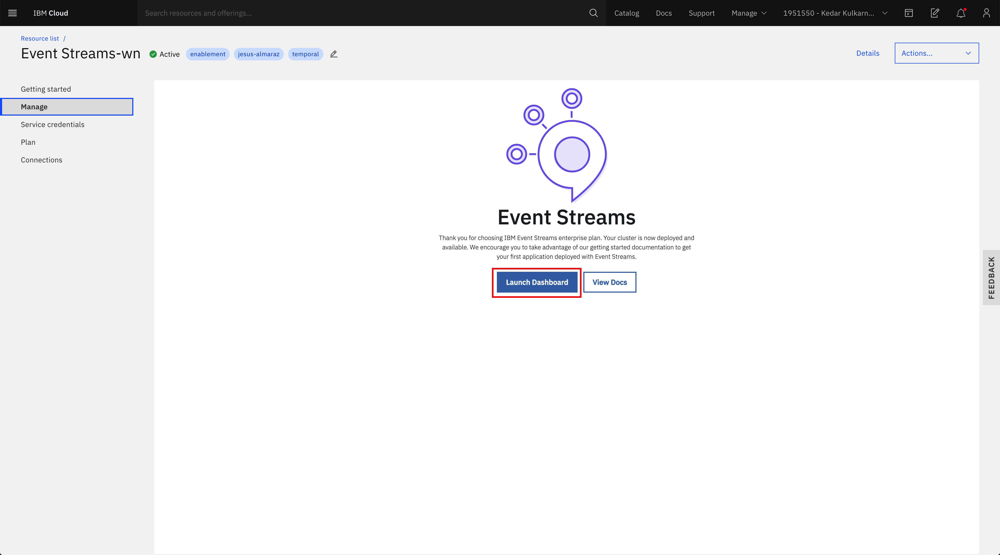

# IBM Event Streams on IBM Cloud Schema Registry lab

This documentation aims to be a introductory hands-on lab on IBM Event Streams on IBM Cloud Schema Registry where we will go through the different capabilities of the Schema Registry that is available for IBM Event Streams on IBM Cloud users.


## Requirements

This lab requires the following components to work against:

1. An IBM Cloud account.
1. An IBM Event Streams instance with the Enterprise plan (Schema Registry is only available to these instance for now)
1. Resource Group / Access Groups??

On your development workstation you will need:

1. IBM Cloud CLI (<https://cloud.ibm.com/docs/cli?topic=cloud-cli-getting-started>)
1. IBM CLoud CLI Event Streams plugin (`$ ibmcloud plugin install event-streams`)
1. Docker (<https://docs.docker.com/get-docker/>)
1. Lab Docker container (HERE HERE HERE HERE)
1. kaf CLI (<https://github.com/birdayz/kaf>) OR KAFDROP?!?!?!?

## Index

* [Introduction](#introduction)
* [Explore](#explore)
* [Topics](#topics)
* [API Key](#api-key)
* [Python Demo Environment](#python-demo-environment)
* [Python Producer](#python-producer)
* [Python Consumer](#python-consumer)
* [Kafdrop](#kafdrop)
* [Messages](#messages)
* [Schemas](#schemas)
* [Messages and Schemas](#messages-and-schemas)
* [Data Evolution](#data-evolution)
* [Access Management](#access-management)

## Introduction

### Overview

The schema registry capability is being developed for the IBM Event Streams managed Kafka service running in IBM Cloud. The purpose of the schema registry is to provide a place to store descriptions of the message formats used by your producers and consumers. The benefit of storing these descriptions is that you are able to validate that your producing and consuming applications will correctly inter-operate.

Currently the schema registry is in early access status. This means that a limited function version of the registry is being made available to a small group of users for the purpose of gathering feedback, and rapidly iterating on the design of the registry. Please note that while the schema registry is in early access, there may be occasions when IBM will delete all of the schema data held within the registry.

### Current features

* Support for creating, listing and deleting schemas via a REST interface
* Support for creating, listing and deleting versions of a schema, via a REST interface
* Support for using schema information in Kafka producer and consumer applications via the Confluent AVRO SerDes
* Support for Apache AVRO as the format used to express schemas
* Support for applying constraints on schema compatibility, either at a global scope, or on a per-schema basis
* Access to schema registry requires authentication and access is controlled via IAM
* Access to individual schemas, and compatibility rules can be controlled via a new IAM schema resource type
* Constraints on maximum schema size (64K), the maximum number of schemas that can be stored in the registry (1000) and the maximum number of versions a schema can have (100)
* SLA of 99.99% availability, consistent with that of the Event Streams service

### Current limitations

* No caching performed for frequently requested schemas
* Does not publish metrics to Sysdig
* Does not generate Activity Tracker events
* There may be other missing functions that you require. Please let IBM know!


## Explore

In this section we are going to do a quick exploration of our out of the box IBM Event Streams instance on IBM Cloud.

### CLI

1. Go to IBM Cloud and click on the user avatar on the top right corner. Then, click on _Log in to CLI and API_ option:

   

1. Copy the `IBM Cloud CLI` login command

   

1. Open a terminal window, paste and execute the command:

	```shell
	$ ibmcloud login -a https://cloud.ibm.com -u passcode -p XsgEKGb84Z
	API endpoint: https://cloud.ibm.com
	Authenticating...
	OK

	Targeted account Kedar Kulkarni's Account (b636d1d83e34d7ae7e904591ac248cfa) <-> 1951550


	Select a region (or press enter to skip):
	1. au-syd
	2. in-che
	3. jp-osa
	4. jp-tok
	5. kr-seo
	6. eu-de
	7. eu-gb
	8. us-south
	9. us-south-test
	10. us-east
	Enter a number> 6
	Targeted region eu-de


	API endpoint:      https://cloud.ibm.com
	Region:            eu-de
	User:              ALMARAZJ@ie.ibm.com
	Account:           Kedar Kulkarni's Account (b636d1d83e34d7ae7e904591ac248cfa) <-> 1951550
	Resource group:    No resource group targeted, use 'ibmcloud target -g RESOURCE_GROUP'
	CF API endpoint:
	Org:
	Space:
	```

1. List your services with `$ ibmcloud resource service-instances` and make sure your IBM Event Streams instance is listed:

	```shell
	$ ibmcloud resource service-instances
	Retrieving instances with type service_instance in all resource groups in all locations under account Kedar Kulkarni's Account as ALMARAZJ@ie.ibm.com...
	OK
	Name                                   Location   State    Type
	IBM Cloud Monitoring with Sysdig-rgd   us-south   active   service_instance
	apieky for simple toolchain            us-east    active   service_instance
	aapoc-event-streams                    us-south   active   service_instance
	tutorial                               us-south   active   service_instance
	mooc-integration-logdna                us-south   active   service_instance
	mooc-integration-sysdig                us-south   active   service_instance
	Event Streams-2t                       us-south   active   service_instance
	Event Streams-wn                       eu-de      active   service_instance
	```

	We can see our instance called: **Event Streams-wn**

1. List your IBM Event Streams instance details with `ibmcloud resource service-instance <instance_name>`:

	```shell
	$ ibmcloud resource service-instance Event\ Streams-wn 
	Retrieving service instance Event Streams-wn in all resource groups under account Kedar Kulkarni's Account as ALMARAZJ@ie.ibm.com...
	OK

	Name:                  Event Streams-wn
	ID:                    crn:v1:bluemix:public:messagehub:eu-de:a/b636d1d83e34d7ae7e904591ac248cfa:b05be932-2a60-4315-951d-a6dd902e687a::
	GUID:                  b05be932-2a60-4315-951d-a6dd902e687a
	Location:              eu-de
	Service Name:          messagehub
	Service Plan Name:     enterprise-3nodes-2tb
	Resource Group Name:
	State:                 active
	Type:                  service_instance
	Sub Type:
	Created at:            2020-05-11T15:54:48Z
	Created by:            kedar.kul@us.ibm.com
	Updated at:            2020-05-11T16:49:18Z
	Last Operation:
						Status    sync succeeded
						Message   Synchronized the instance
	```
	Mind the `\` character in your IBM Event Streams instance.

1. Initialize your IBM Event Streams plugin for the IBM Cloud CLI with `$ ibmcloud es init`:

	```shell
	$ ibmcloud es init

	Select an Event Streams instance:
	1. Event Streams-2t
	2. Event Streams-wn
	3. aapoc-event-streams
	4. tutorial
	Enter a number> 2
	API Endpoint: 	https://mh-tcqsppdpzlrkdmkbgmgl-4c201a12d7add7c99d2b22e361c6f175-0000.eu-de.containers.appdomain.cloud
	OK
	```

1. Check all the CLI commands available to you to manage and interact with your IBM Event Streams instance with `$ ibmcloud es`:

	```shell
	$ ibmcloud es
	NAME:
	ibmcloud es - Plugin for IBM Event Streams (build 1908221834)

	USAGE:
	ibmcloud es command [arguments...] [command options]

	COMMANDS:
	broker                 Display details of a broker.
	broker-config          Display broker configuration.
	cluster                Display details of the cluster.
	group                  Display details of a consumer group.
	group-delete           Delete a consumer group.
	group-reset            Reset the offsets for a consumer group.
	groups                 List the consumer groups.
	init                   Initialize the IBM Event Streams plugin.
	topic                  Display details of a topic.
	topic-create           Create a new topic.
	topic-delete           Delete a topic.
	topic-delete-records   Delete records from a topic before a given offset.
	topic-partitions-set   Set the partitions for a topic.
	topic-update           Update the configuration for a topic.
	topics                 List the topics.
	help, h                Show help

	Enter 'ibmcloud es help [command]' for more information about a command.
	```

1. List your cluster configuration with `$ ibmcloud es cluster`:

	```shell
	$ ibmcloud es cluster
	Details for cluster
	Cluster ID                                                      Controller
	mh-tcqsppdpzlrkdmkbgmgl-4c201a12d7add7c99d2b22e361c6f175-0000   0

	Details for brokers
	ID   Host                                                                                                     Port   Rack
	0    kafka-0.mh-tcqsppdpzlrkdmkbgmgl-4c201a12d7add7c99d2b22e361c6f175-0000.eu-de.containers.appdomain.cloud   9093   fra05
	1    kafka-1.mh-tcqsppdpzlrkdmkbgmgl-4c201a12d7add7c99d2b22e361c6f175-0000.eu-de.containers.appdomain.cloud   9093   fra02
	2    kafka-2.mh-tcqsppdpzlrkdmkbgmgl-4c201a12d7add7c99d2b22e361c6f175-0000.eu-de.containers.appdomain.cloud   9093   fra04
	No cluster-wide dynamic configurations found.
	```

1. List your topics with `$ ibmcloud es topics`:

	```shell
	$ ibmcloud es topics
	OK
	No topics found.
	```

### UI

1. Go to IBM Cloud, log in and click on _Services_ on the top left _Resource summary_ panel:

	

1. Click on your IBM Event Streams instance:

	

1. Click on _Launch Dashboard_ button to open the IBM Event Streams dashboard

	

1. Click on the _Topics_ tab on the top bar menu:

	

1. Observe there isn't any topic yet:

	

## Topics

In this section we are going to see how to create, list and delete topics both using the IBM Event Streams CLI and its UI.

### CLI

1. Create a topic:

	```shell
	$ ibmcloud es topic-create --name demo-topic
	Created topic demo-topic
	OK
	```
	\* Execute `$ ibmcloud es topic-create --help` for more further configuration of your topic creation

1. List topics:

	```shell
	$ ibmcloud es topics
	Topic name
	demo-topic
	OK
	```

1. Display details of a topic:

	```shell
	$ ibmcloud es topic demo-topic
	Details for topic demo-topic
	Topic name   Internal?   Partition count   Replication factor
	demo-topic   false       1                 3

	Partition details for topic demo-topic
	Partition ID   Leader   Replicas   In-sync
	0              2        [2 1 0]    [2 1 0]

	Configuration parameters for topic demo-topic
	Name                  Value
	cleanup.policy        delete
	min.insync.replicas   2
	segment.bytes         536870912
	retention.ms          86400000
	retention.bytes       1073741824
	OK
	```

1. Delete a topic:

	```shell
	$ ibmcloud es topic-delete demo-topic
	Really delete topic 'demo-topic'? [y/N]> y
	Topic demo-topic deleted successfully
	OK
	```

1. List topics:

	```shell
	$ ibmcloud es topics
	OK
	No topics found.
	```

### UI

1. Open the IBM Event Streams user interface (go into your IBM Event Streams service within your IBM Cloud portal and click on the launch dashboard button). Once there, click on the _Topics_ tab from the top menu:

	

1. Click on _Create topic_ button, give your topic a name and click on next

	

1. Set as many partitions for your topic as you desire. For this demo, the default 1 partition suffices. Click next.

	

1. Set the message retention you consider best for your use case. For this demo, we will leave the default _A day_ option. Click on _Create topic_:

	

1. We can now see our new topic:

	

1. To delete a topic, click on the topic options button at the right end of a topic, click on _Delete this topic_ and then on the _Delete_ button in the confirmation pop-up window:

	

1. The topic should now be deleted:

	

## API Key

At this point, we want to create an API key for other applications, tools, scripts to interact with our IBM Event Streams instance.

1. In your IBM Event Streams instance service page, click on _Service credentials_ on the left hand side menu:

	

1. Observe, there is no service credentials yet and click on the _New credential_ button on the top right corner:

	

1. Enter a name for your service, choose _Manager_ role for now and click on _Add_:

	

1. You should now see your new service credential and be able to inspect its details if you click on its dropdown arrow on it left:

	

1. We could have created the service credentials using the CLI as well but we leave that as extra homework for students to try on their own. However, we can explore the service credentials using the CLI with `$ ibmcloud resource service-key <service_credentials_name>`:

	```shell
	$ ibmcloud resource service-key demo-serv-cred
	Retrieving service key demo-serv-cred in all resource groups under account Kedar Kulkarni's Account as ALMARAZJ@ie.ibm.com...

	Name:          demo-serv-cred
	ID:            crn:v1:bluemix:public:messagehub:eu-de:a/b636d1d83e34d7ae7e904591ac248cfa:b05be932-2a60-4315-951d-a6dd902e687a:resource-key:4ba348d2-5fcf-4c13-a265-360e983d99c5
	Created At:    Tue May 12 10:53:02 UTC 2020
	State:         active
	Credentials:
				api_key:                  *****
				apikey:                   *****
				iam_apikey_description:   Auto-generated for key 4ba348d2-5fcf-4c13-a265-360e983d99c5
				iam_apikey_name:          demo-serv-cred
				iam_role_crn:             crn:v1:bluemix:public:iam::::serviceRole:Manager
				iam_serviceid_crn:        crn:v1:bluemix:public:iam-identity::a/b636d1d83e34d7ae7e904591ac248cfa::serviceid:ServiceId-380e866c-5914-4e01-85c4-d80bd1b8a899
				instance_id:              b05be932-2a60-4315-951d-a6dd902e687a
				kafka_admin_url:          https://mh-tcqsppdpzlrkdmkbgmgl-4c201a12d7add7c99d2b22e361c6f175-0000.eu-de.containers.appdomain.cloud
				kafka_brokers_sasl:       [kafka-2.mh-tcqsppdpzlrkdmkbgmgl-4c201a12d7add7c99d2b22e361c6f175-0000.eu-de.containers.appdomain.cloud:9093 kafka-0.mh-tcqsppdpzlrkdmkbgmgl-4c201a12d7add7c99d2b22e361c6f175-0000.eu-de.containers.appdomain.cloud:9093 kafka-1.mh-tcqsppdpzlrkdmkbgmgl-4c201a12d7add7c99d2b22e361c6f175-0000.eu-de.containers.appdomain.cloud:9093]
				kafka_http_url:           https://mh-tcqsppdpzlrkdmkbgmgl-4c201a12d7add7c99d2b22e361c6f175-0000.eu-de.containers.appdomain.cloud
				password:                 *****
				user:                     token
	```

## Python Demo Environment

Given that students' workstations may vary quite a lot, not only on their operating system but also on the tools installed on them and the tools we need for our lab might install differently, we have opted to provide a python demo environment in the form of a Docker container where all the libraries and tools needed are already pre-installed.

### Build

This Docker container can be built by using the [Dockerfile](Dockerfile) provided within this github repository.

To build your python demo environment Docker container, execute the following on your workstation:

```shell
docker build -t "ibmcase/python-schema-registry-lab:latest" .
```
(\*) Mind the **dot** at the end of the command (\**) Be consistent throughout the lab with the name you give to the Docker container.

### Run

In order to run the python demo environment Docker container, execute the following on your workstation:

1. Export your Kafka broker and Kafka API key:

	```shell
	$ export KAFKA_BROKERS=kafka-2.mh-tcqsppdpzlrkdmkbgmgl-4c201a12d7add7c99d2b22e361c6f175-0000.eu-de.containers.appdomain.cloud:9093,kafka-1.mh-tcqsppdpzlrkdmkbgmgl-4c201a12d7add7c99d2b22e361c6f175-0000.eu-de.containers.appdomain.cloud:9093,kafka-0.mh-tcqsppdpzlrkdmkbgmgl-4c201a12d7add7c99d2b22e361c6f175-0000.eu-de.containers.appdomain.cloud:9093

	$ export KAFKA_APIKEY=*****
	```

1. Run the python demo environment container

	```shell
	$ docker run  -e KAFKA_BROKERS=$KAFKA_BROKERS \
				-e KAFKA_APIKEY=$KAFKA_APIKEY \
				-v ${PWD}:/tmp/lab \
				--rm \
				-ti ibmcase/python-schema-registry-lab:latest bash
	```

1. Go to `/tmp/lab` to find all the assets you will need to complete this lab.

## Python Producer

In this section we describe the python scripts we will be using in order to be able to produce messages to a Kafka topic.

### Send Message

The python script that we will use to send a message to a Kafka topic is [ProducePlainMessage.py](src/ProducePlainMessage.py) where we have the following:

1. A function to parse the arguments:

	```python
	def parseArguments():
		global TOPIC_NAME
		print("The arguments for this script are: " , str(sys.argv))
		if len(sys.argv) == 2:
			TOPIC_NAME = sys.argv[1]
		else:
			print("[ERROR] - The producePlainMessage.py script expects one argument: The Kafka topic to publish the message to")
			exit(1)
	```

1. A function to create the event to be sent:

	```python
	def createEvent():
		print('Creating event...')

		event = {
				"eventKey" : "1", 
				"message" : "This is a test message"
				}

		print("DONE")
		return event
	```

1. The main where we will:
	1. Parse the arguments
	1. Create the Event to be sent
	1. Create the Kafka Producer and configure it
	1. Send the event

	```python
	if __name__ == '__main__':
		# Get the Kafka topic from the arguments
		parseArguments()
		# Create the event to be sent
		event = createEvent()
		# Print it out
		print("Event to be published:")
		print(event)
		# Create the Kafka Producer
		kp = KafkaProducer(KAFKA_BROKERS,KAFKA_APIKEY)
		# Prepare the Kafka Producer
		kp.prepareProducer("ProducePlainMessagePython")
		# Publish the event
		kp.publishEvent(TOPIC_NAME,event,"eventKey")
	```

As you can see, this python code depends on a Kafka Producer which is explained next.

### Kafka Producer

This script, called [KcProducer.py](kafka/KcProducer.py), will actually be the responsible for creating the Kafka Producer, initialize and configure it and provide the publish method:

1. Initialize and prepare the Kafka Producer

	```python
	class KafkaProducer:

		def __init__(self,kafka_brokers = "",kafka_apikey = ""):
			self.kafka_brokers = kafka_brokers
			self.kafka_apikey = kafka_apikey

		def prepareProducer(self,groupID = "pythonproducers"):
			# Configure the Kafka Producer (https://docs.confluent.io/current/clients/confluent-kafka-python/#kafka-client-configuration)
			options ={
					'bootstrap.servers':  self.kafka_brokers,
					'group.id': groupID,
					'security.protocol': 'SASL_SSL',
					'sasl.mechanisms': 'PLAIN',
					'sasl.username': 'token',
					'sasl.password': self.kafka_apikey
			}
			# Print out the configuration
			print("[KafkaProducer] - This is the configuration for the producer:")
			print('[KafkaProducer] - {}'.format(options))
			# Create the producer
			self.producer = Producer(options)
	```

1. Publish method

	```python
	def publishEvent(self, topicName, eventToSend, keyName):
			# Print the event to send
			dataStr = json.dumps(eventToSend)
			# Produce the message
			self.producer.produce(topicName,key=eventToSend[keyName],value=dataStr.encode('utf-8'), callback=self.delivery_report)
			# Flush
			self.producer.flush()
	```

### Run

In order to send a message then, we need to:

1. Run the python demo environment Docker container as explained in the previous section [Python Demo Environment](###python-demo-environment)
1. Change directory to `/tmp/lab/src`

	```shell
	root@2a0cf0ffeaed:/# cd /tmp/lab/src/
	root@2a0cf0ffeaed:/tmp/lab/src# ll
	total 16
	drwxr-xr-x  6 root root  192 May 12 16:50 .
	drwxr-xr-x 12 root root  384 May 12 14:16 ..
	-rw-r--r--  1 root root 2103 May 12 16:50 ConsumeAvroMessage.py
	-rw-r--r--  1 root root 1754 May 12 16:50 ConsumePlainMessage.py
	-rw-r--r--  1 root root 3187 May 12 16:50 ProduceAvroMessage.py
	-rw-r--r--  1 root root 1893 May 12 15:37 ProducePlainMessage.py
	```

1. Execute the `ProducePlainMessage.py`

	```shell
	# python producePlainMessage.py test
	@@@ Executing script: producePlainMessage.py
	The arguments for this script are:  ['producePlainMessage.py', 'test']
	Creating event...
	DONE
	Event to be published:
	{'eventKey': '1', 'timestamp': 1589297817, 'message': 'This is a test message'}
	[KafkaProducer] - This is the configuration for the producer:
	[KafkaProducer] - {'bootstrap.servers': 'kafka-2.mh-tcqsppdpzlrkdmkbgmgl-4c201a12d7add7c99d2b22e361c6f175-0000.eu-de.containers.appdomain.cloud:9093,kafka-1.mh-tcqsppdpzlrkdmkbgmgl-4c201a12d7add7c99d2b22e361c6f175-0000.eu-de.containers.appdomain.cloud:9093,kafka-0.mh-tcqsppdpzlrkdmkbgmgl-4c201a12d7add7c99d2b22e361c6f175-0000.eu-de.containers.appdomain.cloud:9093', 'group.id': 'ProducePlainMessagePython', 'security.protocol': 'SASL_SSL', 'sasl.mechanisms': 'PLAIN', 'sasl.username': 'token', 'sasl.password': 'ZU85u1yRvanIemzp_lYn9uOwzWyija3ig2t6ElLlPQG1'}
	[KafkaProducer] - Message delivered to test [0]
	```

## Python Consumer

## Kafdrop

Unfortunately, IBM Event Streams on IBM Cloud user interface does not yet give users the ability to inspect messages on the diff
Kafdrop is a web UI for viewing Kafka topics and browsing consumer groups. The tool displays information such as brokers, topics, partitions, consumers, and lets you view messages: <https://github.com/obsidiandynamics/kafdrop>

**COMPLETE IN CASE WE WANT TO SEE THIS iNSTEAD OF THE SCRIPTS**
